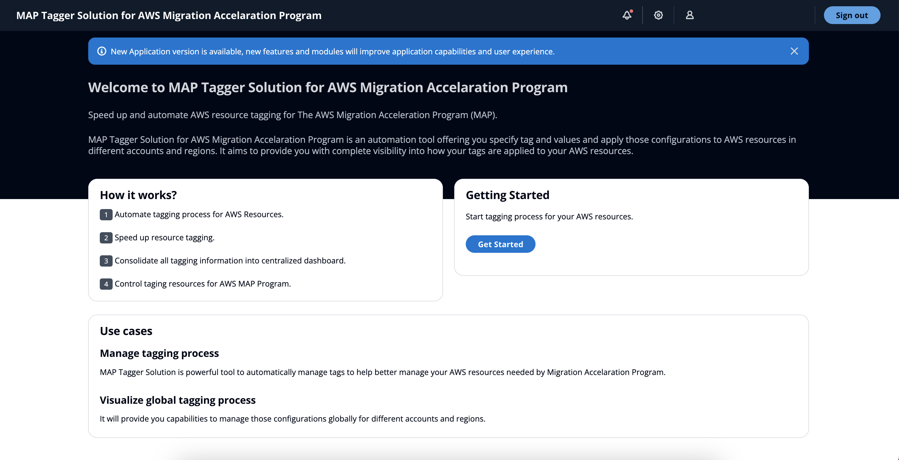
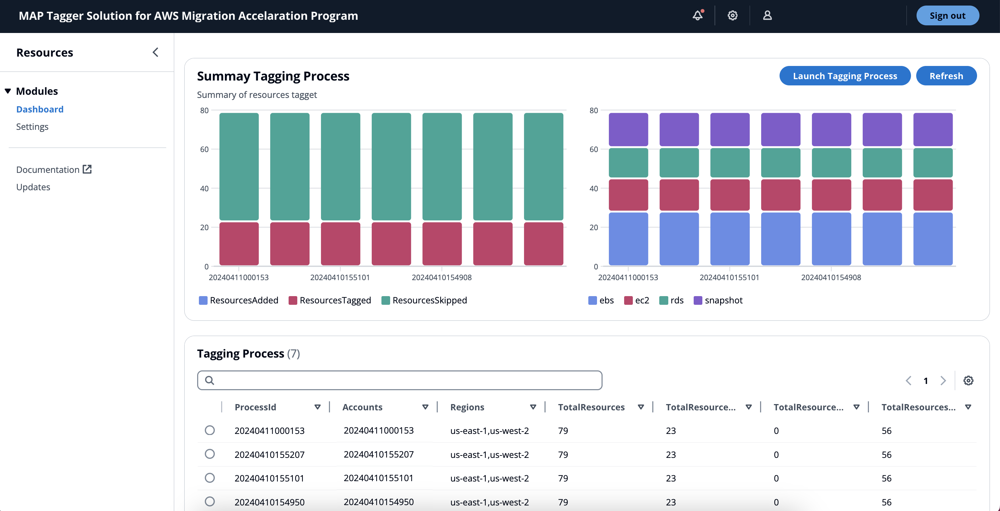
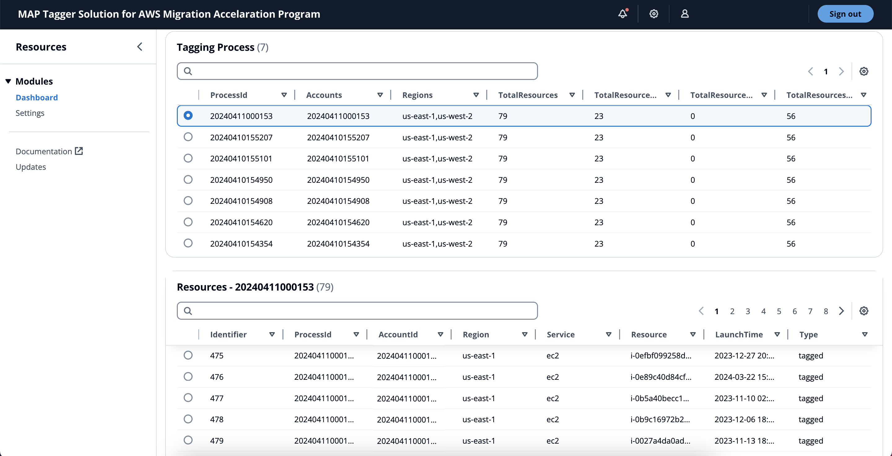
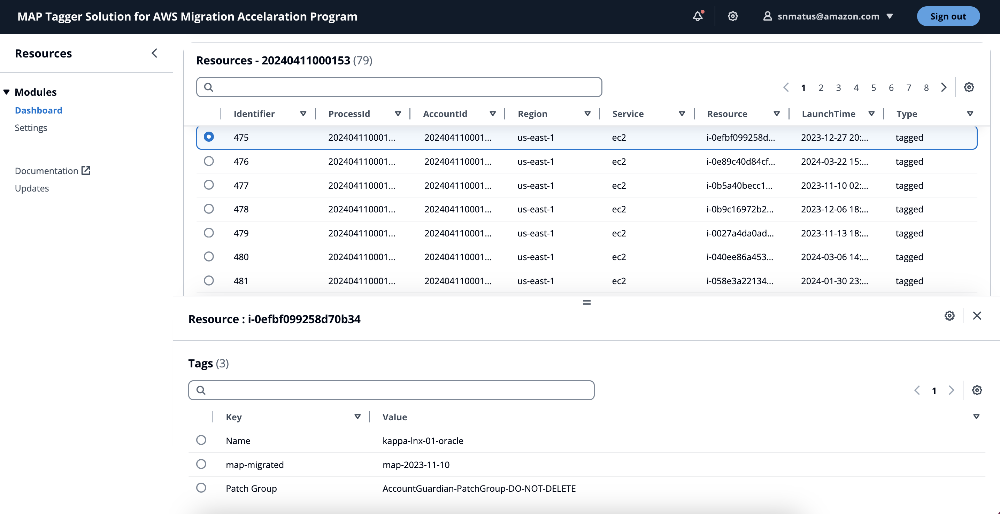
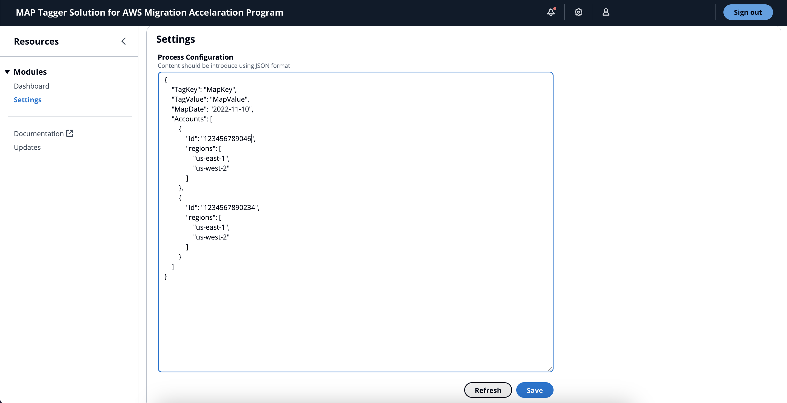
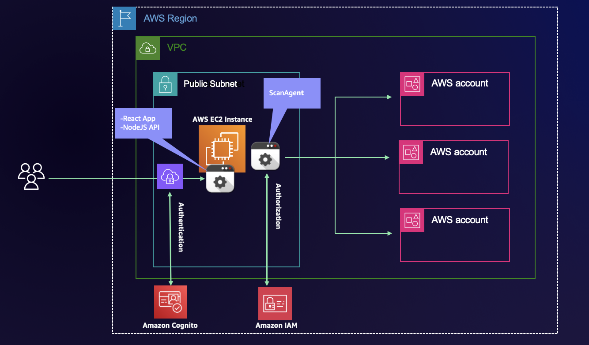

# MAP Tagger Solution

> **Disclaimer:** The sample code; software libraries; command line tools; proofs of concept; templates; or other related technology (including any of the foregoing that are provided by our personnel) is provided to you as AWS Content under the AWS Customer Agreement, or the relevant written agreement between you and AWS (whichever applies). You are responsible for testing, securing, and optimizing the AWS Content, such as sample code, as appropriate for production grade use based on your specific quality control practices and standards. Deploying AWS Content may incur AWS charges for creating or using AWS chargeable resources, such as running Amazon EC2 instances or Amazon Cognito.

## What is MAP Tagger Solution?

MAP Tagger Solution is an automation tool offering you automate and speed up tagging process needed by AWS Migration Accelaration Program,
it will provide you capabilities to manage those configurations for different accounts and regions. 
It aims to provide you with complete visibility into how your tags are applied to your AWS resources.
                                          

## How does Tagging Solution look like?

## Solution Components

- **Frontend.** React Developed Application to provide user interface to visualize performance information.

- **Backend.** NodeJS API Component to gather performance information from central repository and AWS Metadata

## Architecture

## Resource Usage and Cost

MAP Tagger Solution will use following resources:

- **AWS EC2 instance.**
     The cost of this resource will depend of size selected during the deployment process. AWS EC2 instance pricing can be review [here](https://aws.amazon.com/ec2/pricing/).

## Specific use case

Even when MAP Tagger can solve problems along the way of tagging in MAP Large engagements, it’s safe to say there are specific use cases that allow the tool to be functional. MAP Tagger is only effective (as of April 2024) where:

- There’s only one MAP engagement in the customer payer account.
- There’s a defined list of accounts where the workloads are being tagged (and regions).
- There’s a defined start date of migrated workloads (usually the MAP signing date).
- There are no special workloads that require a different tag to provide extra credits (DB&A, SAP, etc).
- The migrated services are among the List of services covered by the solution
- Any scenario outside of the previously described may cause an undesired effect on the tagging process.
- List of services covered by the solution: EC2 Instances, EBS Volumes, EBS Snapshots, EFS/FSx file systems, FSx Snapshots, RDS Instances, RDS Snapshots, S3 Buckets, Elastic Load Balancers, DynamoDB Tables, AWS Backup Vaults, AWS Backup Plans, ECS/EKS Clusters, ECR Repositories, EMR Clusters, Transit Gateways, Transit Gateways Attachments, WorkSpaces, Lambda functions and API Gateways.

## Solution Deployment

> **Time to deploy:** Approximately 10 minutes.

### Launch CloudFormation Stack

Follow the step-by-step instructions to configure and deploy the MAP Tagger Solution into your account.

1. Make sure you have sign in AWS Console already.
2. Download AWS Cloudformation Template ([MAPTaggerSolution.template](/conf/MAPTaggerSolution.template)) located into conf folder.
3. [**Open AWS CloudFormation Console**](https://console.aws.amazon.com/cloudformation/home#/stacks/create/template?stackName=MAPTaggerSolution)
4. Create an stack using Cloudformation template ([MAPTaggerSolution.template](/conf/MAPTaggerSolution.template)) already downloaded on step 2.
5. Input **Stack name** parameter. 
6. Acknowledge **Application Updates - Disclaimer** parameter.
7. Input **Username** parameter, this username will be used to access the application. An email will be sent with temporary password from AWS Cognito Service. 
8. Input **AWS Linux AMI** parameter, this parameter specify AWS AMI to build App EC2 Server. Keep default value.
9. Select **Instance Type** parameter, indicate what instance size is needed.
10. Select **VPC Name** parameter, indicate VPC to be used to deploy application server.
11. Select **Subnet Name** parameter, indicate subnet to be used to deploy application server, this subnet needs to have outbound internet access to reach AWS APIs.
12. Select **Public IP Address** parameter, the deployment will assign private IP Address by default to access the application, you can assign Public IP Address to access the application in case you need it, Select (true) to assign Public IP Address.
13. Input **CIDR** parameter, specify CIDR inbound access rule, this will grant network access for the application.
14. Click **Next**, Click **Next**, select **acknowledge that AWS CloudFormation might create IAM resources with custom names**. and Click **Submit**.
15. Once Cloudformation has been deployed, gather application URL from output stack section. Username will be same you introduce on step 7 and temporary password will be sent by AWS Cognito Service.
16. Application deployment will take around 5 minutes to be completed.

> **Note:** Because you are connecting to a site with a self-signed, untrusted host certificate, your browser may display a series of security warnings. 
Override the warnings and proceed to the site. To prevent site visitors from encountering warning screens, you must obtain a trusted, 
CA-signed certificate that not only encrypts, but also publicly authenticates you as the owner of the site.

## Security

See [CONTRIBUTING](CONTRIBUTING.md#security-issue-notifications) for more information.

## License

This library is licensed under the MIT-0 License. See the [LICENSE](LICENSE.txt) file.

